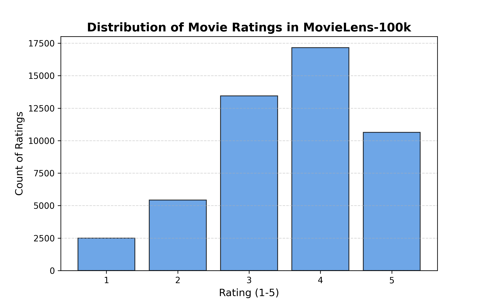
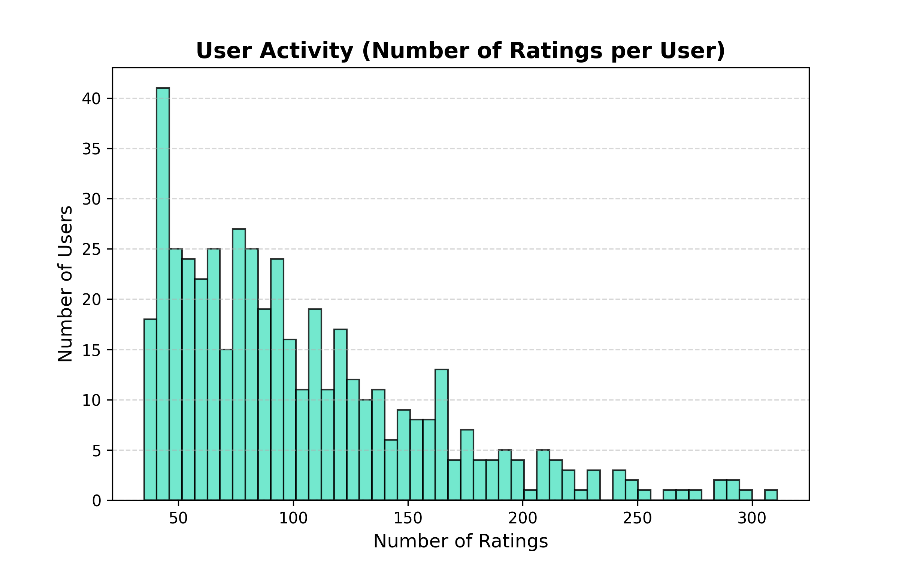
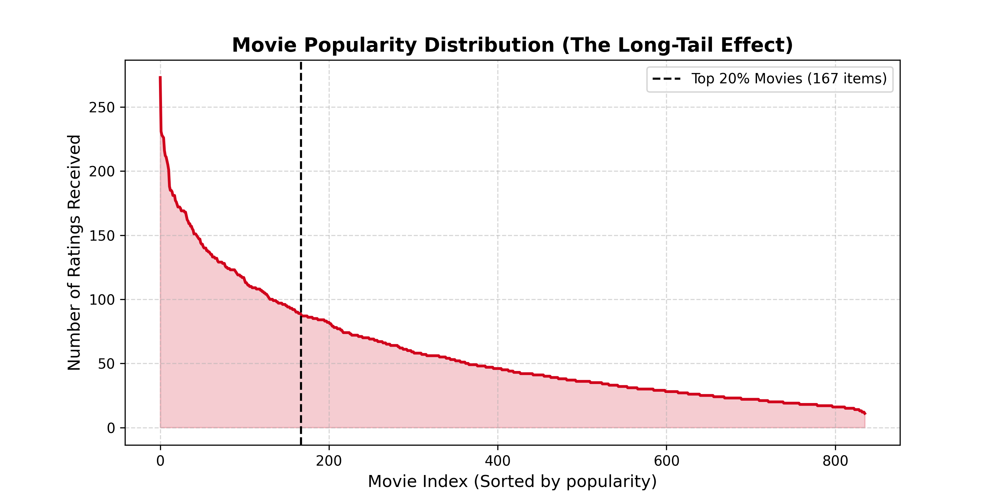

# MovieLens Recommendation System

This project showcases a practical movie recommendation pipeline built on the MovieLens 100k dataset. It combines data analysis, multiple recommender strategies, and evaluation metrics in one easy-to-run workflow.

## Why this project stands out

- Explores the MovieLens dataset with visual analytics and insight generation.
- Implements multiple recommendation approaches:
  - popularity-based recommendations
  - user-based and item-based collaborative filtering
  - matrix factorization with FunkSVD
- Includes an evaluation workflow for RMSE, Precision@K, and Recall@K.
- Provides a polished, easy-to-follow setup and usage experience for learning and demo purposes.

## Project structure

- `download_dataset.py`: downloads the MovieLens 100k ratings and item metadata.
- `eda.py`: generates exploratory data analysis visuals and insights.
- `popularity_recommender.py`: popularity-based recommendations using an IMDb-style weighted score.
- `collaborative_filtering.py`: user-based and item-based collaborative filtering using cosine similarity.
- `matrix_factorization.py`: custom FunkSVD matrix factorization and an alternative TruncatedSVD implementation.
- `scratch/phase7_eval.py`: evaluation pipeline for RMSE and Precision/Recall metrics.
- `main.py`: unified entry point for running the full pipeline.
- `app.py`: web-based interface for interacting with the recommendation system.

## Quick start

1. Create a Python environment (recommended):

```bash
python -m venv venv
venv\Scripts\activate
```

2. Install dependencies:

```bash
python -m pip install -r requirements.txt
```

3. Download the dataset (if it is not already present):

```bash
python download_dataset.py
```

## Run the project

Run the full pipeline:

```bash
python main.py --download --eda --popularity --user-cf --item-cf --funk-svd --eval
```

Try individual recommenders:

```bash
python main.py --popularity --top-n 10
python main.py --user-cf --user-id 1 --top-n 5
python main.py --funk-svd --user-id 1 --top-n 5
```

You can also launch the app interface:

```bash
python app.py
```

## Results and visual snapshots

The project generates clear visual outputs that help communicate the recommendations and data patterns. These screenshots highlight the result quality and visibility of the project:

### Ratings distribution



### User activity distribution



### Long-tail effect



## Notes

- The dataset should be available under `data/ml-100k/u.data` and `data/ml-100k/u.item`.
- If you omit `--user-id`, the CLI automatically selects a valid user from the current dataset to avoid runtime errors.
- Generated plots are saved to the `plots/` directory.
- `scratch/phase7_eval.py` performs train/test evaluation and calculates RMSE, Precision@K, and Recall@K.
- A trained model is also available in `models/funksvd_model.pkl` for quick experiments.

## Summary

This repository is a strong example of a machine-learning recommendation project with a clear workflow, visual outputs, and multiple recommendation strategies. The updated README is designed to make the project easier to understand and more appealing to viewers and reviewers.
